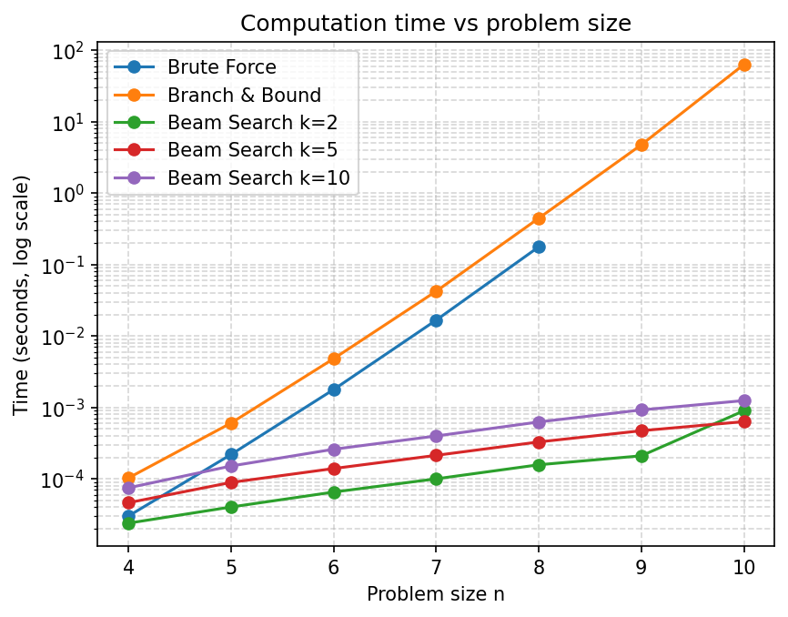
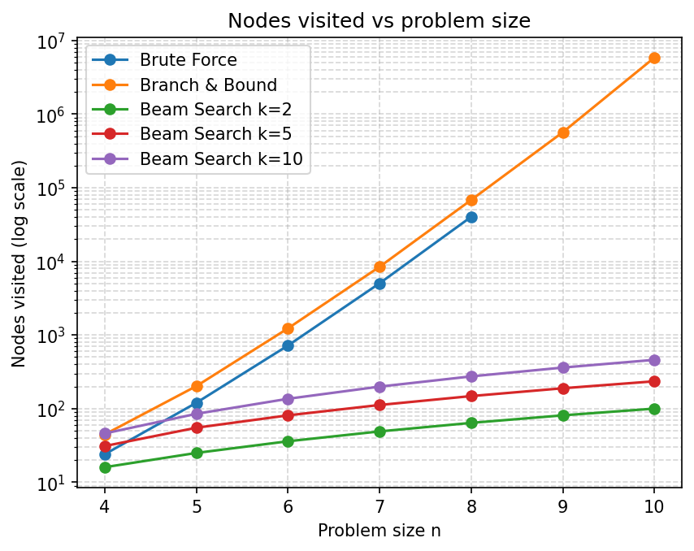
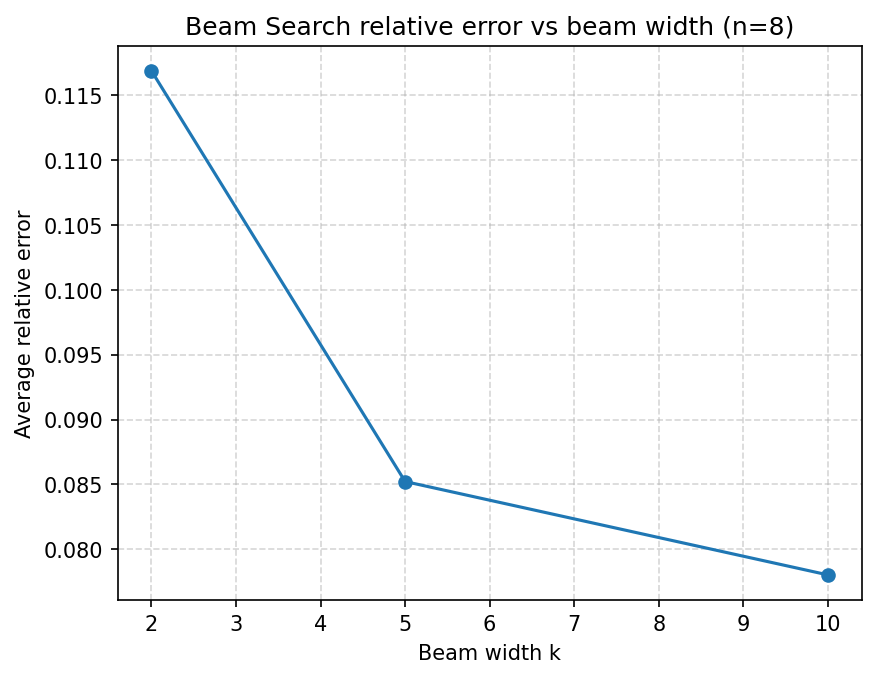

# QAP Solver — Branch & Bound and Beam Search

## Problem statement

The **Quadratic Assignment Problem (QAP)** asks for an assignment `f` of `n` facilities to `n` locations that minimises:

```
sum_{i,j} w(i,j) * d(f(i), f(j))
```

where `w(i,j)` is the flow between facilities `i` and `j`, and `d(k,l)` is the distance between locations `k` and `l`.
QAP is NP-hard; exact methods become infeasible for `n > ~15`.

---

## Algorithms

### Branch and Bound (B&B)
Exact method. Builds a decision tree where each level assigns the next facility to a free location.
Search order: iterative DFS on a LIFO stack, expanding the most-promising child first (sorted by LB ascending, pushed in reverse order so the smallest LB is popped first).

**Lower bound:** `partial_cost(assignment)` — the sum of `w(i,j)*d(f(i),f(j))` for all already-assigned pairs `i,j`.
This is a valid LB because all flows and distances are non-negative: any future assignment can only add non-negative terms to the objective, so the partial cost never overestimates the true cost of completing that assignment.

**Initial upper bound:** a greedy heuristic — assign facilities one by one, each time choosing the location with the smallest marginal cost increase. This provides a much tighter initial bound than `∞`, leading to significantly more pruning.

### Beam Search (BS)
Approximate method with controllable quality/speed trade-off. Operates BFS level by level. At each level:
1. Expand all nodes in the current beam.
2. Sort children by LB (ascending).
3. Keep only the best `beam_width` (k) children; prune the rest.

For `beam_width ≥ n!` the algorithm degenerates to exhaustive BFS and recovers the exact optimum.

---

## Project structure

```
qap-solver/
├── pyproject.toml
├── main.py                           # demo entry point
├── src/
│   ├── RandomNumberGenerator.py      # shared RNG (do not modify)
│   ├── instance.py                   # QAPInstance + generate_instance()
│   ├── solver_base.py                # Node, SolverResult, evaluate(), partial_cost()
│   ├── brute_force.py                # exhaustive baseline
│   ├── branch_and_bound.py           # B&B + DFS + greedy UB init
│   ├── beam_search.py                # BS + BFS + beam pruning
│   └── benchmark.py                  # experiment runner + CSV writer
├── tests/                            # pytest test suite (85 tests)
├── scripts/
│   ├── run_experiments.py            # generates results/benchmark.csv
│   └── plot_results.py               # generates results/*.png
└── results/
    ├── benchmark.csv
    ├── time_vs_n.png
    ├── nodes_vs_n.png
    └── error_vs_beam_width.png
```

---

## Usage

```bash
# Run demo (n=6, seed=42 — all three algorithms)
uv run python main.py

# Run benchmark experiments (generates results/benchmark.csv)
uv run python scripts/run_experiments.py

# Generate plots (requires benchmark.csv)
uv run python scripts/plot_results.py

# Run test suite
uv run pytest
```

---

## Results

### Computation time vs problem size



### Nodes visited vs problem size



### Beam Search relative error vs beam width (n=8)



### Benchmark sample (n=6, seed=42)

| algorithm | cost | optimum | rel. error | nodes visited | time (s) |
|---|---:|---:|---:|---:|---:|
| brute_force | 12429 | 12429 | 0.00% | 720 | 0.0019 |
| branch_and_bound | 12429 | 12429 | 0.00% | 1197 | 0.0048 |
| beam_search(k=2) | 15149 | 12429 | 21.88% | 36 | 0.0001 |
| beam_search(k=5) | 14547 | 12429 | 17.04% | 81 | 0.0001 |
| beam_search(k=10) | 13972 | 12429 | 12.41% | 136 | 0.0003 |

---

## Trade-offs

| | Branch & Bound | Beam Search |
|---|---|---|
| **Optimality** | Exact (guaranteed) | Heuristic (no guarantee) |
| **Time complexity** | Worst-case O(n!) — exponential | O(n² · k) — polynomial in n |
| **Space** | O(n · stack_depth) | O(n · k) |
| **Lower bound quality** | Simple partial cost — valid but weak; few nodes pruned compared to Gilmore-Lawler | Same LB used for beam ranking |
| **n=10** | Seconds to tens of seconds per seed | < 1 ms for any k |
| **Typical error (BS)** | — | 10–25% for k=2..10 on these instances |

B&B with a simple LB is practical up to roughly n=10 on modern hardware. Beyond that, the weak lower bound means very few nodes are pruned and runtime grows near-factorially.

Beam Search with k=10 typically runs 3–4 orders of magnitude faster than B&B at n=8..10, at the cost of a solution ~10–25% above optimum.

---

## Limitations

- **Weak lower bound:** `partial_cost` only accounts for pairs where both facilities are already assigned. It ignores interactions between assigned and unassigned facilities. A stronger bound such as the **Gilmore-Lawler bound** could prune far more nodes (often 10–100× in practice), making B&B viable for larger n.
- **Beam Search quality:** with a simple LB as the ranking criterion, early beam selections may discard globally-optimal partial assignments. A tighter bound would improve both pruning (B&B) and ranking quality (BS).
- **No parallelism:** both algorithms are single-threaded; a parallel B&B with work-stealing would scale B&B significantly.
